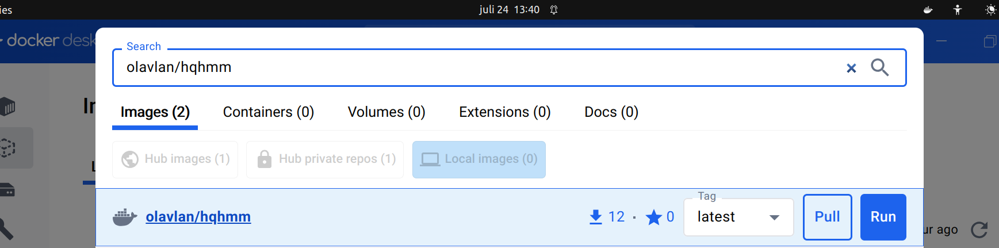
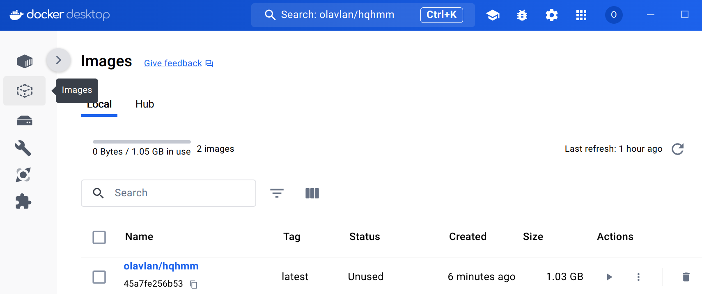
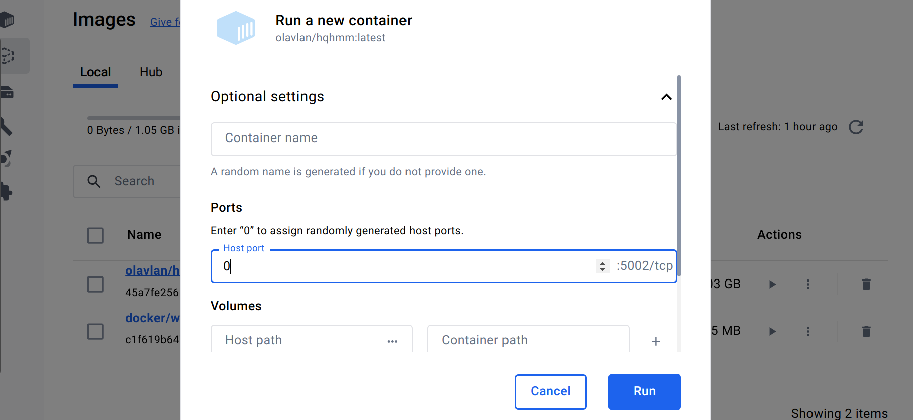
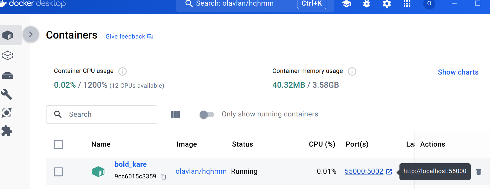
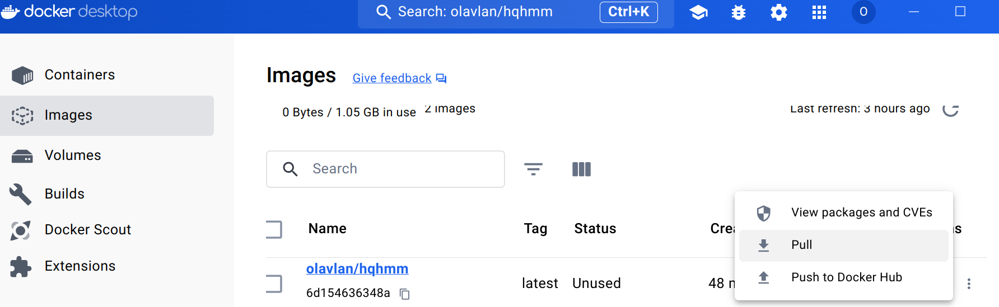
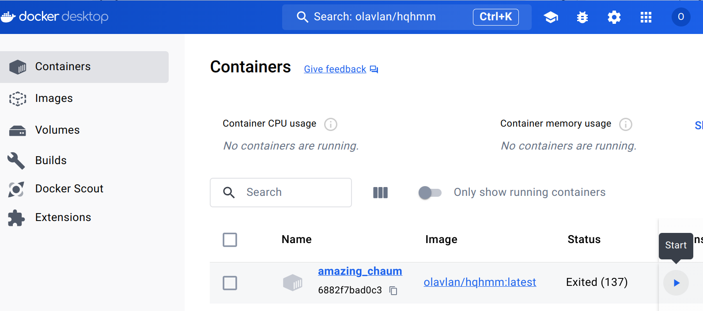

# High-Quality Heightmap Meshing

A webapp that helps transform heightmaps (as image files) to high quality triangular meshes. Uses [delatin](https://github.com/mapbox/delatin) or [hmm](https://github.com/fogleman/hmm).

## Easy installation

1. Install Docker Desktop: https://www.docker.com/products/docker-desktop/
2. Open Docker and search for _olavlan/hqhmm_ in the top search bar. Click _Pull_ on the first result. 

   
Screenshot

   
   

3. Go to the _Images_ tab. On the row that says _olavlan/hqhmm_, click ▶. 

   
Screenshot

   
   

4. Expand _Optional settings_, write _0_ in the field _Ports_, and click _Run_.

   
Screenshot

   
   

5. Click on  to open the app in your browser. 

   
Screenshot

   
   

6. To update the app, go to the *Images* tab, find the row that says _olavlan/hqhmm_, click on  to show more options, and click *Pull*. 

   
Screenshot

   
   

## About Docker

* Docker will run in the background even if you close the dashboard. Look for the   icon in your taskbar to reopen the dashboard or quit Docker completely.
* Go to the *Containers* tab to verify that the webapp is still running. If not, you can restart it by clicking ▶. 

   
Screenshot

   
   

* An *image* is created when you click *Pull* and a *container* is created when you click *Run*. 
* To update to the newest release of the app, delete previous containers and images of the app, and repeat steps 2-5. 
