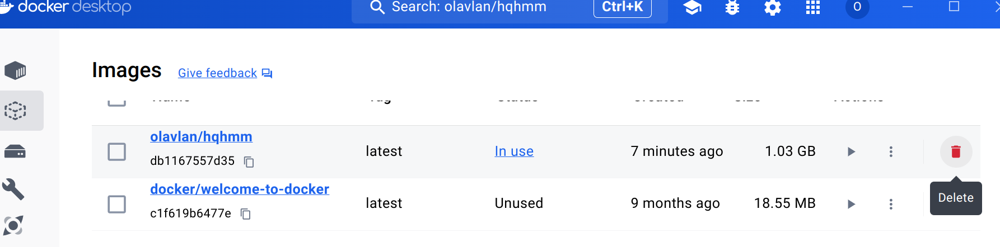
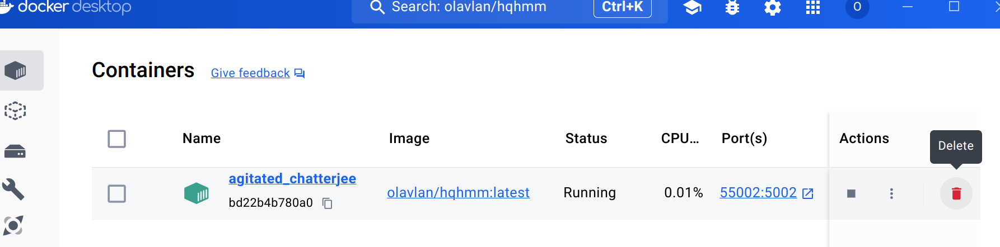

# High-Quality Heightmap Meshing

A webapp that helps transform heightmaps (as image files) to high quality triangular meshes. Uses [delatin](https://github.com/mapbox/delatin) or [hmm](https://github.com/fogleman/hmm).

## Easy installation

1. Install Docker Desktop: https://www.docker.com/products/docker-desktop/
2. Open Docker and search for _olavlan/hqhmm_ in the top search bar. Click _Pull_ on the first result. 

   
Screenshot

   
   

3. Go to the _Images_ tab. Click  ▶ on the row that says _olavlan/hqhmm_. 

   
Screenshot

   
   

4. Expand _Optional settings_, write _0_ in the field _Ports_, and click _Run_.

   
Screenshot

   
   

5. You can now open the app in your browser; go to the *Containers* tab, find the row that says _olavlan/hqhmm_, and click on the link under *Port(s)*. 

   
Screenshot

   
   

## Update to newest version

1. Delete existing images and containers of the app. 

   
Screenshot

   
   
   

2. Repeat steps 2-5 above. 

## About Docker

* Docker will run in the background even if you close the dashboard. Look for the   icon in your taskbar to reopen the dashboard or quit Docker completely.