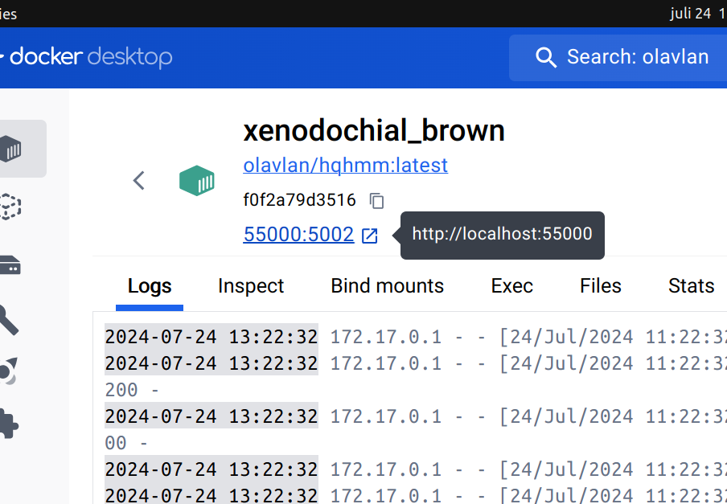

# High-Quality Heightmap Meshing

A Flask app that helps transform heightmaps (as image files) to high quality triangular meshes. Uses [delatin](https://github.com/mapbox/delatin) or [hmm](https://github.com/fogleman/hmm).

## Easy installation

1. Install Docker Desktop: https://www.docker.com/products/docker-desktop/
2. Open Docker and search for _olavlan/hqhmm_ in the top search bar. Click on _Pull_:
3. Go to _Images_ and click on ▶:
4. Expand _Optional settings_, write _0_ in the field _Ports_ and then click on _Run_.
5. Open the link for the web app:
   

To get the newest release of the app, repeat steps 2-4.
